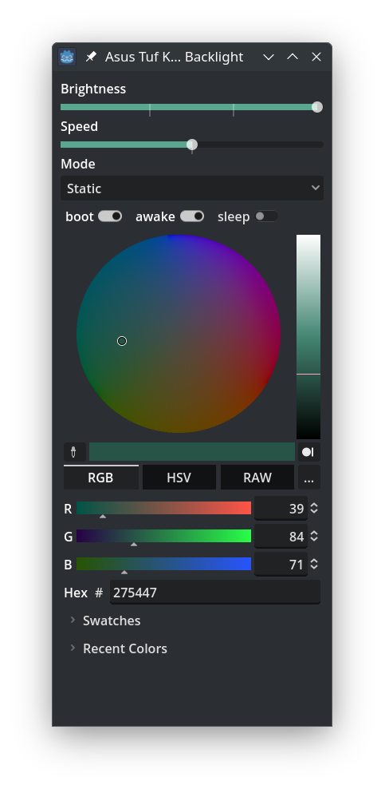

# BacklightKeyboardAsusTuf

**BacklightKeyboardAsusTuf** is a graphical interface for controlling the keyboard backlight on Asus TUF series laptops (possibly other models as well) on Linux systems. The project is built using **Godot 4**.

This project is based on the [AsusTUFLinuxKeyboard](https://github.com/llybin/AsusTUFLinuxKeyboard) repository but includes enhanced functionality:
- The ability to save backlight colors.
- Input of colors in various formats (e.g., HEX, RGB, and others).

## Screenshot of the interface  


## Features  
- Support for controlling backlight colors through a convenient GUI.
- Saving color schemes.
- Support for inputting colors in multiple formats: HEX, RGB, and others.
- Compatibility with Asus TUF series laptops (possibly other series as well).

## Installation
1. Download the executable file of the latest version from the [releases](https://github.com/talkafk/BacklightKeyboardAsusTuf/releases) section.
2. Set write permissions for the backlight files:
```bash
sudo chmod 222 /sys/class/leds/asus::kbd_backlight/kbd_rgb_state /sys/class/leds/asus::kbd_backlight/kbd_rgb_mode /sys/class/leds/asus::kbd_backlight/brightness
```
3. Run the executable file.


## Compatibility
- The project has been tested on Asus TUF laptops.
- Compatibility with other Asus models is possible but not guaranteed.
